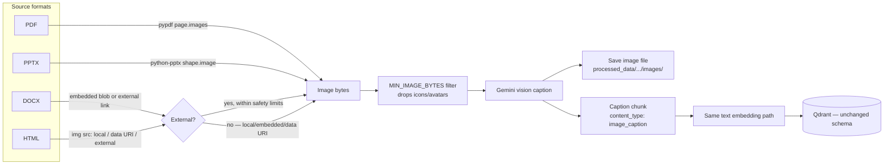
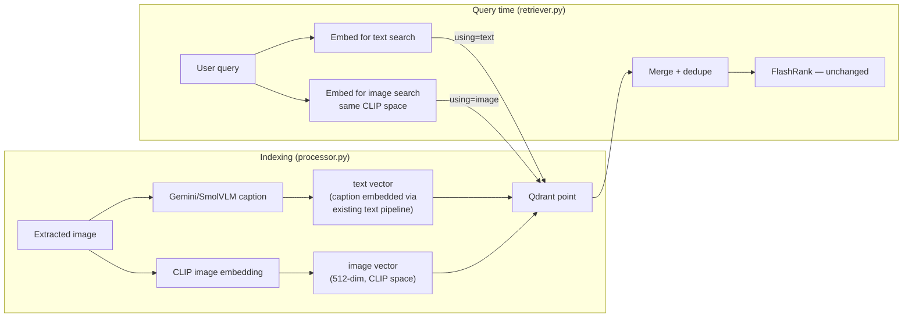

# 20 — Multimodal RAG (Phase 1: Caption &amp; Embed, Phase 2: Native Image Vectors)

> **One-line summary:** Images referenced anywhere in the ingested corpus — embedded in a PDF/PPTX/DOCX, or linked externally in DOCX/HTML — are extracted, captioned by a vision model, and indexed both as searchable caption text (Phase 1) and as native CLIP image vectors for direct visual-similarity search (Phase 2).

---

## Why This Exists

Every document loader in this system extracted **text only**. `parse_pdf` even logged *"File may be fully image-based"* when a page yielded no text — and then moved on, discarding the page. For a Kubernetes/networking/hardware knowledge base, a meaningful fraction of the actual information lives in diagrams, screenshots, and architecture illustrations that were invisible to the system. This phase closes that gap for the corpus loaders can now see: PDF, PPTX, DOCX, and HTML.

This is **Phase 1** of the three-phase multimodal plan (see the roadmap discussion this implements): captions ride the existing text-embedding pipeline unmodified. Phase 2 (native image vectors for visual similarity search) and Phase 3 (vision-native responder + image upload) are not built yet.

---

## What We Learned Before Writing Any Code

Two assumptions from the original plan turned out to be wrong, caught by testing against the real files in `DATA/true_data` instead of assuming:

| File | Expected | Actual |
|---|---|---|
| `architecture.pptx` | Diagram-heavy, motivating example for this feature | **Zero embedded images.** All 66 slides are built from native PowerPoint vector shapes (`FREEFORM`, `AUTO_SHAPE`) — there is nothing for image extraction to find without rendering the slide itself, which is out of scope here. |
| `cronjobs.docx`, `job_management.html`, `pods_autoscale.html` | Images embedded in the file | **100% external links.** All 24 image references across these three files point to `miro.medium.com` or `docs.databricks.com` — the docs were clearly copied from web articles that kept images as hosted links rather than embedding them. |

This meant the original PDF/PPTX-only scope would have delivered **zero** multimodal value for the actual Kubernetes corpus (`true_data`) — the only place it would have helped is the image-heavy PDFs in `noisy_data` (confirmed: 75 real embedded images extracted from one file alone). DOCX and HTML support, plus external-URL fetching, were added specifically because of this finding — not part of the original plan, but necessary to make the feature do anything for the corpus it was built for.

---

## Architecture



Nothing downstream of the caption text changes. `qdrant_service.py`, `ranking_service.py`, and `retriever.py` are untouched — a caption is indistinguishable from any other text chunk to the rest of the pipeline.

---

## New Files

```
app/ingestion/loaders/images.py       ← extraction for all 4 formats + fetch/decode helpers
app/services/vision/captioning.py     ← Gemini vision captioning (google-genai SDK)
```

### `app/ingestion/loaders/images.py`

Four extraction functions, one per format that can carry images:

| Function | Source | Handles |
|---|---|---|
| `extract_images_from_pdf` | `pypdf` `page.images` | Embedded raster images only |
| `extract_images_from_pptx` | `python-pptx` `shape.image` | Embedded `PICTURE` shapes only (not vector diagrams) |
| `extract_images_from_docx` | `python-docx` relationship parts | Embedded blobs **and** external links |
| `extract_images_from_html` | BeautifulSoup `` tags | Local relative paths, `data:` URIs, **and** external links |

All four return `list[ExtractedImage]` — `(data, ext, mime_type, location)` — so `processor.py` treats every format identically after extraction.

**`MIN_IMAGE_BYTES = 3000`** filters out icons, bullets, and avatars before they ever reach captioning. Confirmed working: a 64×64 author-avatar image in `pods_autoscale.html` was correctly dropped, while the two real diagrams in the same file passed through.

### External Image Fetching

Since every image in the actual `true_data` corpus is an external link, fetching is **on by default**, not a fallback. It's bounded on every axis that matters for fetching content referenced inside arbitrary documents:

```python
MAX_FETCH_BYTES = 15 * 1024 * 1024   # 15 MB cap
FETCH_TIMEOUT = 10                    # seconds
```

- **Scheme-restricted** — only `http`/`https`.
- **SSRF-guarded** — `_is_safe_public_host()` resolves the hostname and rejects private, loopback, link-local, reserved, or multicast IPs before any request is made. Verified: `localhost` and `127.0.0.1` are correctly rejected; `miro.medium.com` correctly resolves and passes.
- **Content-type validated** — the response must declare `image/*`; anything else is discarded.
- **Streamed with a hard size cap** — aborts mid-download rather than buffering an arbitrarily large response.
- **Best-effort** — any failure (timeout, 404, non-image content) returns `None` and that one image is skipped; it never fails the document's ingestion.

Confirmed end-to-end against the real corpus: all 20 diagrams in `cronjobs.docx` fetched successfully (500–700 KB PNGs — real architecture diagrams from the source Medium article).

> **Escape hatch:** set `ALLOW_EXTERNAL_IMAGE_FETCH=false` in `.env` to disable fetching entirely and keep ingestion strictly local (embedded/data-URI images only). Off by default is *not* the default — fetching is on, because for this corpus turning it off means zero multimodal value from `true_data`.

> **Known edge case, not yet handled specially:** one image in `pods_autoscale.html` is a 9.4 MB animated GIF — under the 15 MB cap, so it's fetched and would be sent to the vision model as-is. Gemini's inline-data limits and typical response quality for animated GIFs (usually only the first frame is meaningfully interpreted) make this worth a follow-up — either a stricter size threshold specifically gating the *captioning* step (independent of the fetch cap), or frame-extraction before captioning. Not fixed here; flagged for the next pass.

### `app/services/vision/captioning.py`

```python
def caption_image(image_bytes: bytes, mime_type: str) -> str | None:
    ...
```

- Uses **`google-genai`** (`from google import genai`), the current Gemini SDK — deliberately not `google-generativeai` (already a dependency for embeddings), which prints its own deprecation warning: *"All support for the `google.generativeai` package has ended."* New multimodal code has no reason to build on a package with no further bug fixes.
- Lazy-initialized client, matching the existing pattern for the embedding model and FlashRank ranker — no API call fires at import time.
- Model is configurable via `GEMINI_VISION_MODEL` (default `gemini-2.5-flash`), not hardcoded.
- Best-effort: returns `None` on any failure. A captioning failure skips that one image; it does not fail the document.

The caption prompt is deliberately literal, not creative:

```python
CAPTION_PROMPT = (
    "You are indexing a technical document for search. Describe this image in "
    "2-4 factual sentences: what it shows (diagram, screenshot, chart, table, "
    "photo), the key technical elements visible (labels, components, "
    "architecture, code, numbers), and what a reader would learn from it. "
    "Be specific and literal — do not speculate beyond what is visible."
)
```

#### Zero-Cost Local Fallback — SmolVLM-2B

`caption_image()` tries Gemini first, and falls through to a **local SmolVLM-2B** model (`HuggingFaceTB/SmolVLM-Instruct`, configurable via `SMOLVLM_MODEL_ID`) on *any* Gemini failure — quota exhausted, rate-limited, network error, or API outage:

```python
def caption_image(image_bytes: bytes, mime_type: str) -> str | None:
    caption = _caption_with_gemini(image_bytes, mime_type)
    if caption:
        return caption
    return _caption_with_smolvlm(image_bytes)
```

**Why fall back on any failure, not just quota-exhaustion specifically?** All of these failure modes mean the same thing from the caller's perspective — "no caption from Gemini right now" — and the local model is a reasonable universal fallback for all of them. Distinguishing "quota" from "transient network blip" would require inspecting SDK-specific exception types for no real benefit; either way the answer is the same: try the free local model instead of giving up on the image.

**Why SmolVLM-2B specifically:** at ~2B parameters it stays CPU-runnable at reasonable speed — a real consideration for this corpus, since a single `noisy_data` PDF alone yielded 75 embedded images and the full corpus could mean thousands. A 7B+ open VLM would be far more accurate but too slow on CPU at that volume for an ingestion-time fallback.

**Lazy-loaded, like everything else heavy in this codebase** — `_get_smolvlm()` only downloads and loads the model on the *first* Gemini failure. A run where Gemini's free-tier quota holds for the whole batch never touches this path or its multi-GB download.

> **Dependency requirement.** SmolVLM's architecture (Idefics3-based) needs `transformers>=4.46.0`. At the time this feature was first written, this repo's venv had `transformers==4.17.0` (pulled transitively via `sentence-transformers`, years out of date) — too old to recognize the SmolVLM model type. `requirements.txt` pins the floor explicitly. **Update:** by the time of the live test below, the venv already had `transformers==4.57.6` — well above the floor, no upgrade was needed. A fresh environment following `requirements.txt` will get a version that satisfies this automatically.

**Now live-tested against both real paths.** `transformers` was already at 4.57.6 in this environment — the version floor was already satisfied, no upgrade needed. A real end-to-end call against `caption_image()` on a real extracted image (a 360 KB PNG from a `noisy_data` PDF) confirmed the fallback chain works exactly as designed: Gemini failed with `429 RESOURCE_EXHAUSTED`, and SmolVLM caught it and returned a caption without the call raising or the ingestion step failing.

> **Real quota finding, not theoretical.** The isolated Gemini call surfaced the actual error: `generativelanguage.googleapis.com/generate_content_free_tier_requests` is capped at **20 requests/day** for `gemini-2.5-flash` on the free tier — already exhausted at the time of this test. For context, a single `noisy_data` PDF alone yielded 75 extractable images. **In practice, any real ingestion run of nontrivial size will exhaust the Gemini quota almost immediately and SmolVLM will end up doing the large majority of captioning — not occasional fallback duty.** This matters because SmolVLM-2B is a materially weaker model than `gemini-2.5-flash`; caption quality across a real corpus should be expected to skew toward SmolVLM's ceiling, not Gemini's. Options worth considering before a full-corpus ingestion run: a paid Gemini tier (raises the daily cap substantially), spacing a large ingestion run across multiple days to stay under the free-tier cap, or accepting SmolVLM as the de facto primary captioner and tuning expectations (and possibly the prompt) around that.

---

## Ingestion Wiring

`app/ingestion/processor.py` — `process_images()` routes by extension to the right extractor, captions each surviving image, saves it locally, and returns caption records shaped exactly like a text chunk:

```python
{
    "text": "[Image — page 4] A diagram showing...",
    "content_type": "image_caption",
    "image_path": "processed_data/true/cronjobs.docx_3.png",
    "location": "image 3",
}
```

`process_file()` merges these with ordinary text chunks into one list before the existing save → embed → index steps — **unchanged** from before this feature, just fed a slightly richer chunk list:

```python
all_chunks = [{"text": c, "content_type": "text"} for c in text_chunks] + image_chunks
```

The Qdrant payload gains two optional fields (`content_type`, and `image_path`/`location` when present) — additive only. `res.payload.get("text", "")` and `res.payload.get("source", "Unknown")`, which retrieval already reads, are untouched.

> **Re-ingestion required to pick this up.** Existing `processed_data/*.json` files and the Qdrant collection were built before this change. Run `python -m app.ingestion.processor DATA --wipe` to regenerate everything with image captions included.

---

## What's Deliberately Out of Scope for Phase 1

- **PPTX vector-shape diagrams are still invisible.** `architecture.pptx`'s 66 slides of freeform/auto-shape diagrams have no `PICTURE` shapes to extract — capturing those would require rendering each slide to an image (e.g. via a headless LibreOffice conversion), which is a meaningfully larger change than image extraction and isn't part of this phase.
- **No vision-native answering.** The responder still only ever sees caption text, never the actual image bytes (that's Phase 3).

---

## Phase 2 — Native Image Vectors

Captions are lossy — a caption can miss visual detail a direct similarity match would catch, and it only matches queries phrased similarly to how the caption happened to be worded. Phase 2 adds a second, independent search path: the actual image pixels, embedded and searched directly.

### Architecture



### Qdrant Schema Change — Named Vectors

The collection now defines **two named vectors per point** instead of one unnamed vector:

```python
# app/ingestion/processor.py
vectors_config={
    "text": models.VectorParams(size=text_dim, distance=models.Distance.COSINE),
    "image": models.VectorParams(size=512, distance=models.Distance.COSINE),  # CLIP dim
}
```

- **Every point** gets a `"text"` vector — a plain chunk's own text, or an image caption's text (unchanged from Phase 1).
- **Only image-caption points** additionally get an `"image"` vector — Qdrant allows a point to define a subset of a collection's named vectors, so plain text chunks simply have no `"image"` entry and are naturally excluded from image-space search.

> **Breaking change, requires re-ingestion.** A collection created before this change has a single *unnamed* default vector — upserting points with named vectors (`{"text": ..., "image": ...}`) against it is a schema mismatch. `--wipe` is mandatory the first time a collection adopts this schema; there is no in-place migration path.

### CLIP — Image Embedding

`app/services/retrieval/image_embedding.py` — `clip-ViT-B-32` via `sentence-transformers` (already a dependency, no new package). CLIP's core property: **text and images share one embedding space**, so `embed_text_for_image_search(query)` and `embed_image(image_bytes)` land in the same 512-dim space and can be compared directly — no separate cross-modal glue needed.

Zero cost, local, lazy-loaded (same pattern as everything else heavy in this codebase) — importing the module never triggers a download; the first real embedding call does, once (a few hundred MB, cached afterwards by `sentence-transformers`).

### Indexing — `app/ingestion/processor.py`

Image caption chunks now carry their raw bytes through the pipeline under an internal-only key (`_image_bytes`, stripped before the `processed_data/*.json` is saved — not JSON-serializable, and `image_path` already points at the saved file):

```python
if chunk["content_type"] == "image_caption":
    payload["image_path"] = chunk["image_path"]
    payload["location"] = chunk["location"]
    image_vector = embed_image(chunk["_image_bytes"])
    if image_vector:
        vectors["image"] = image_vector

points.append(models.PointStruct(id=str(uuid.uuid4()), vector=vectors, payload=payload))
```

Best-effort, matching every other step in this pipeline: if `embed_image()` fails, the point is still indexed with just its `"text"` vector — a missing image embedding doesn't lose the caption's text-searchability.

### Retrieval — `app/services/retrieval/qdrant_service.py`, `app/agents/nodes/retriever.py`

- `search_enterprise_knowledge()` now explicitly targets `using="text"` (unchanged behavior, just now explicit about which named vector).
- New `search_by_image_similarity()` targets `using="image"`. Unlike the text search, this is **additive and best-effort by design** — it catches its own exceptions and returns `[]` rather than raising `QdrantSearchError`, so a collection that hasn't been migrated to the Phase 2 schema yet (no `"image"` vector at all) degrades cleanly to text-only results instead of breaking retrieval.
- `retrieve_node()` runs both searches, merges and dedupes by content (a caption chunk can legitimately surface from both, since it has both vectors), then hands the merged list to the same FlashRank reranking step as before — reranking is format-agnostic (plain text in, plain text out), so it needed no changes.

**Deliberately not built**: a heuristic to detect "is this a visual query" and only run image-space search then. Both searches run on every technical query instead — simpler, avoids a brittle keyword classifier, and the merge/rerank step naturally suppresses irrelevant image hits for queries that aren't visual at all.

---

## What's Deliberately Out of Scope for Phase 2

- **No vision-native answering.** The responder still only sees text (captions), never image pixels — still Phase 3.
- **Not live-tested against real Qdrant data.** Written and import-verified; blocked on missing `QDRANT_API_KEY`/`QDRANT_CLUSTER_ENDPOINT` in `.env` — the first real exercise of the named-vector schema, CLIP embedding, and merged search is still pending a `--wipe` re-ingestion once those credentials are available.

---

## Track A (Phase 3 prep) — Images Now Render in the UI

Built ahead of the rest of Phase 3 because both the vision-native responder and the image-upload flow need the same underlying fix: retrieved image metadata was being written into Qdrant's payload (`image_path`, `content_type`, `location`) but never read back out anywhere downstream.

**What changed:**
- `qdrant_service.py` — both `search_enterprise_knowledge()` and `search_by_image_similarity()` now include `content_type`, `image_path`, and `location` in their returned records (previously only `content`, `source`, `score`, `match_type`).
- `retriever.py` — builds a `content → full_record` lookup before reranking (rather than changing `rerank_documents()`'s plain-string signature), recovers each reranked chunk's full record afterward by exact content match, and returns a new `image_sources` list alongside `documents` for any reranked chunk that's an image caption.
- `state.py` — `AgentState` gains `image_sources: List[dict]`. No reducer is defined, so every node that can skip retrieval (the planner's `CONVERSATIONAL` branch, the retriever's `QdrantSearchError` branch) explicitly resets it to `[]` — otherwise a previous technical turn's retrieved images would leak into a later, unrelated conversational reply within the same thread.
- `main.py` — `/query` returns `image_sources` alongside `sources` on every response path (success, guardrail-blocked, and error).
- `ui/app.py`, `ui/st_cloud_ui.py` — a new "🖼️ Retrieved Images" expander renders each image via `st.image(image_path, ...)`, falling back to a caption-only note if the file isn't reachable (the known local-filesystem-path limitation below).

> **Known limitation, not fixed here.** `image_path` is a local filesystem path from wherever ingestion ran. This works today because the FastAPI backend and Streamlit UI share a filesystem. If they're ever split across machines, image rendering would silently fall back to the caption-only note — would need a static file endpoint or object storage to fix properly.

---

## Track B (Phase 3a) — Vision-Native Responder

Before this, the responder only ever saw caption *text* — even with Track A rendering the actual image in the UI, the LLM generating the answer never looked at the image itself, only whatever the captioning model wrote about it.

**New file:** `app/services/vision/answering.py` — `answer_with_vision(prompt, images)`, reusing the same `google-genai` client pattern as `captioning.py` (its own lazy singleton, not shared — matches the existing per-module convention in `embedding.py`, `ranking_service.py`, `image_embedding.py`). Sends the prompt plus up to `MAX_VISION_IMAGES = 3` actual images to `GEMINI_VISION_MODEL`. Best-effort: returns `None` on any failure.

**Wired into `app/agents/nodes/responder.py`:**

```python
image_sources = state.get("image_sources", [])
if image_sources:
    vision_images = _load_vision_images(image_sources)
    vision_answer = answer_with_vision(prompt, vision_images) if vision_images else None
    if vision_answer:
        return {"final_answer": vision_answer, ...}
    # falls through to the existing text-only path below, unchanged
```

`_load_vision_images()` reads raw bytes from each `image_sources` entry's `image_path` (populated by Track A), best-effort per file — a missing or unreadable image just drops from the batch rather than failing the answer.

**Why the fallback is low-risk:** if `answer_with_vision()` returns `None` for any reason — Gemini quota exhausted, rate-limited, network error, no readable images — execution falls through to the exact `portkey_client` call that already exists. This isn't new fallback logic; it's the current behavior, demoted from "the only path" to "the fallback path."

**Only reachable on the technical branch.** `image_sources` is explicitly reset to `[]` on the planner's `CONVERSATIONAL` branch (see Track A), so a purely conversational turn never attempts the vision-native path even if a previous turn in the same thread retrieved images.

> **Quota exposure, not yet resolved.** This shares the same Gemini free-tier quota that ingestion-time captioning already exhausted once in live testing (20 `generate_content` requests/day for `gemini-2.5-flash`). Query-time vision-native answers now compete with ingestion-time captioning for that same daily budget. The three options from the Phase 3 plan — paid tier, spacing ingestion runs, or accepting the text-only fallback as the practical default — still need a decision before this sees real traffic. Not blocking to build or merge; blocking to rely on.

> **Not live-tested.** Written and import-verified only — exercising this for real needs a retrieved image in context, which needs the blocked `--wipe` re-ingestion (missing Qdrant credentials) to happen first.

---

## Track D (Phase 3 prep) — Image Upload Guardrail

Built ahead of Track C (image upload in chat — not started yet) because the guardrail needs to exist *before* an upload path can be wired to it, not after.

**New file:** `app/guardrails/image_guard.py` — `validate_uploaded_image(image_bytes, content_type) -> (bool, str | None)`. Deliberately **not** a NeMo/Colang rail: Colang's intent-matching runs on text, and an uploaded image has none, so the off-topic/jailbreak/dialog flows in `app/guardrails/rails.py` can't say anything about it. This is the pragmatic v1 gate:

- **Size cap** — reuses `MAX_FETCH_BYTES` from `app/ingestion/loaders/images.py` (15 MB) rather than redefining it, so there's one size limit to reason about across both the ingestion-time external-fetch path and the query-time upload path.
- **Content-type allowlist** — `image/png`, `image/jpeg`, `image/gif`, `image/webp`, `image/bmp`. Correctly handles a `Content-Type` header with parameters (e.g. `image/jpeg; charset=binary`) by splitting on `;` before comparing.
- **Audit logging** — every upload event (passed or rejected) is logged distinctly via Logfire, mirroring the existing guardrail-fired logging pattern in `rails.py`, so uploads are visible in the same observability stream as every other guardrail decision.
- **Baseline safety net** — Gemini's own default safety filtering applies downstream in `answer_with_vision()` (Track B), since nothing in this codebase disables it.

Exported from `app/guardrails/__init__.py` alongside `initialize_rails`/`guard`, so it's discoverable in the same place as the rest of the guardrail system despite not being NeMo-based.

**Live-tested with real functional cases** (pure logic, no API calls needed): empty input, undersized valid image, oversized image, wrong content-type, and a content-type string with trailing parameters — all five passed.

> **Stretch goal, not built.** A custom NeMo Python action for explicit content moderation — the same extension mechanism `DOCS/08_GUARDRAILS.md` documents for text-side PII detection, applied to images. Worth building once real usage shows the v1 baseline (size/type discipline + Gemini's default filtering) isn't sufficient on its own.

> **Wired, see below.** The upload endpoint below calls this guardrail at Gate 0, before the graph ever runs.

---

## Track C — Image Upload Endpoint

The backend/graph half of Track C: a real `/query` request can now carry an image, and it flows through validation, forced-technical routing, and the vision-native path built in Tracks B and D. The Streamlit file-picker widget that actually *sends* one is still outstanding — see the end of this section.

**Request shape** (`app/main.py` — `QueryRequest`):

```python
class QueryRequest(BaseModel):
    q: str
    thread_id: Optional[str] = "default_user"
    image_base64: Optional[str] = None
    image_content_type: Optional[str] = None
```

Base64 in the existing JSON body, not multipart — costs ~33% payload inflation, worth it to avoid a second request-handling path for what's typically one image per chat message.

**Gate 0 — validate before the graph runs**, same "reject at the gate" pattern as the existing text guardrail (Gate 1):

```python
if request.image_base64:
    image_bytes = base64.b64decode(request.image_base64, validate=True)
    valid, reason = validate_uploaded_image(image_bytes, content_type)
    if not valid:
        return {"answer": reason, "thought_process": ["Image Upload: Rejected", reason], ...}
    uploaded_image = {"data": image_bytes, "mime_type": content_type}
```

> **Caught by testing:** the initial implementation called `base64.b64decode(request.image_base64)` without `validate=True`. Python's default decode mode silently *drops* invalid characters instead of raising — confirmed with a real test case (`'YWJjZGVm@Zw=='` decodes to `b'abcdefg'` with no error in default mode, but correctly raises with `validate=True`). Without the flag, the "invalid encoding" error path would never actually fire for a meaningful class of malformed input; it would just silently pass through corrupted bytes instead.

**Routing** (`app/agents/nodes/planner.py`): an uploaded image always routes technical, skipping the LLM intent-classification call entirely — there's no ambiguity to resolve when the user attached something to ask about, and retrieval still runs so any complementary text context is available alongside the image.

**Generation** (`app/agents/nodes/responder.py`): the vision-native image list now combines the uploaded image (first, so it's prioritized if `MAX_VISION_IMAGES` truncates) with any retrieved images:

```python
vision_images = []
if uploaded_image:
    vision_images.append((uploaded_image["data"], uploaded_image["mime_type"]))
vision_images.extend(_load_vision_images(state.get("image_sources", [])))
```

**Honest degrade on fallback:** if vision fails and an image was uploaded, the text-only fallback prompt gets an explicit note that the image couldn't be analyzed — rather than letting the text-only model silently ignore or hallucinate about an attachment it structurally cannot see:

```python
if has_uploaded_image:
    prompt += (
        "\n\nNOTE: The user attached an image, but it could not be analyzed right now "
        "(temporary issue). Acknowledge this honestly, answer using only the text "
        "context above if relevant, and ask the user to describe the image or try "
        "again shortly."
    )
```

**State:** `AgentState.uploaded_image: Optional[dict]` — set fresh from the current request on every `/query` call (never carried over from a previous turn), matching the same reset discipline already established for `image_sources` in Track A.

> **Still outstanding.** The Streamlit UI has no file-picker or chat attachment widget yet — `ui/app.py`/`ui/st_cloud_ui.py` don't send `image_base64`. The endpoint is ready to receive one; nothing in this codebase currently produces the request that would exercise it end-to-end.

> **Not live-tested against the real Gemini vision-answering call or a real upload.** The base64 decode/validate logic was functionally tested with real bytes (see Track D). The full path — a real image through Gate 0, forced-technical routing, and `answer_with_vision()` — has not been exercised against a live request.

---

## See Also

- `app/ingestion/loaders/images.py`, `app/services/vision/captioning.py` — Phase 1 implementation
- `app/services/retrieval/image_embedding.py` — Phase 2 CLIP embedding
- `app/services/retrieval/qdrant_service.py`, `app/agents/nodes/retriever.py` — Phase 2 named-vector search + merge
- `DOCS/02_INGESTION_ENGINE.md` — the text-only ingestion pipeline this extends
- `DOCS/12_RELIABILITY_FIXES.md` — the reliability fixes that preceded this feature
